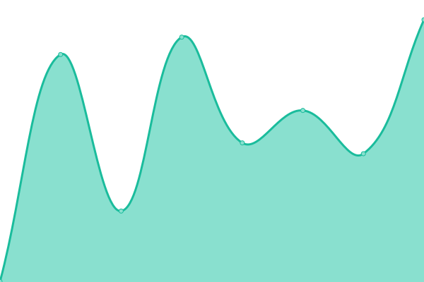
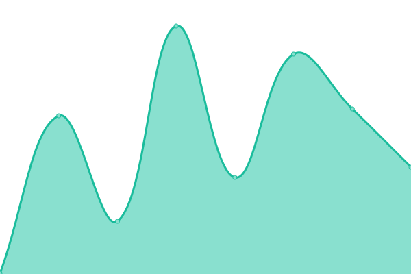
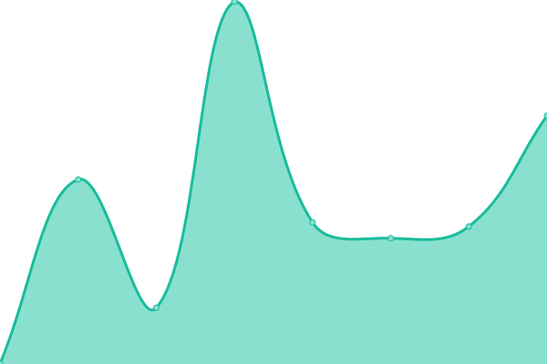
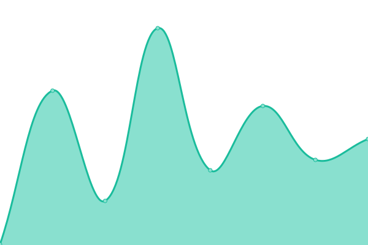

# [📈 Live Status](https://status.howtohack.nl): <!--live status--> **🟧 Partial outage**

This repository contains the open-source uptime monitor and status page for [Koen-HowtoHack](https://status.howtohack.nl), powered by [Upptime](https://github.com/upptime/upptime).

With [Upptime](https://upptime.js.org), you can get your own unlimited and free uptime monitor and status page, powered entirely by a GitHub repository. We use [Issues](https://github.com/Koen-HowtoHack/status/issues) as incident reports, [Actions](https://github.com/Koen-HowtoHack/status/actions) as uptime monitors, and [Pages](https://status.howtohack.nl) for the status page.

<!--start: status pages-->
<!-- This summary is generated by Upptime (https://github.com/upptime/upptime) -->
<!-- Do not edit this manually, your changes will be overwritten -->
<!-- prettier-ignore -->
| URL | Status | History | Response Time | Uptime |
| --- | ------ | ------- | ------------- | ------ |
|  [How to Hack](https://www.howtohack.nl/) | Online (up) | [how-to-hack.yml](https://github.com/Koen-HowtoHack/status/commits/HEAD/history/how-to-hack.yml) | 

 220ms
     
 | 

<a href="https://status.howtohack.nl/history/how-to-hack">100.00%</a>
    

|  [Statuspagina How to Hack & Codeblocks](https://status.howtohack.nl/) | Online (up) | [statuspagina-how-to-hack-and-codeblocks.yml](https://github.com/Koen-HowtoHack/status/commits/HEAD/history/statuspagina-how-to-hack-and-codeblocks.yml) | 

 139ms
     
 | 

<a href="https://status.howtohack.nl/history/statuspagina-how-to-hack-and-codeblocks">100.00%</a>
    

|  [Codeblocks](https://www.codeblocks.nl/) | Online (up) | [codeblocks.yml](https://github.com/Koen-HowtoHack/status/commits/HEAD/history/codeblocks.yml) | 

 236ms
     
 | 

<a href="https://status.howtohack.nl/history/codeblocks">100.00%</a>
    

|  [Codeblocks CDN](https://cdn.codeblocks.nl/) | Online (up) | [codeblocks-cdn.yml](https://github.com/Koen-HowtoHack/status/commits/HEAD/history/codeblocks-cdn.yml) | 

 156ms
     
 | 

<a href="https://status.howtohack.nl/history/codeblocks-cdn">100.00%</a>
    

|  [Codeblocks Docs](https://docs.codeblocks.nl/) | Offline (down) | [codeblocks-docs.yml](https://github.com/Koen-HowtoHack/status/commits/HEAD/history/codeblocks-docs.yml) | 

 0ms
     
 | 

<a href="https://status.howtohack.nl/history/codeblocks-docs">0.00%</a>
    

<!--end: status pages-->

[**Visit our status website →**](https://status.howtohack.nl)

## 📄 License

- Powered by: [Upptime](https://github.com/upptime/upptime)
- Code: [MIT](./LICENSE) © [Anand Chowdhary](https://anandchowdhary.com), supported by [Pabio](https://pabio.com)
- Data in the `./history` directory: [Open Database License](https://opendatacommons.org/licenses/odbl/1-0/)
